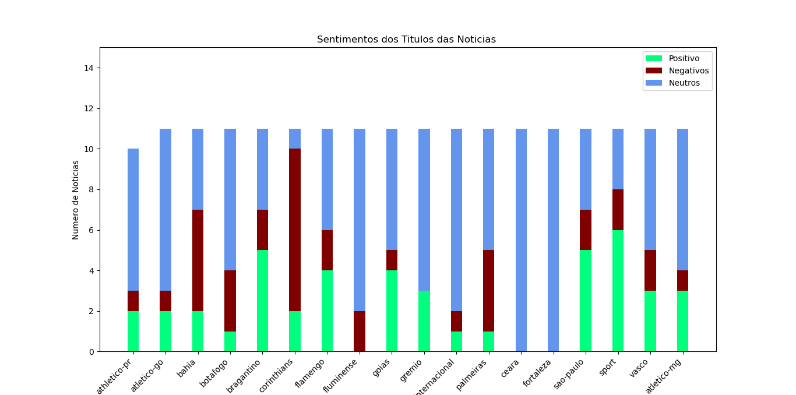
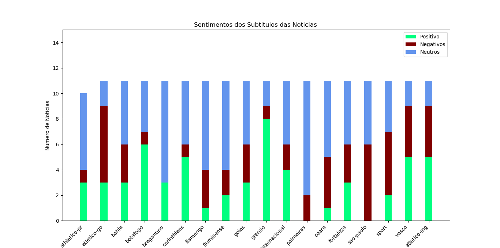
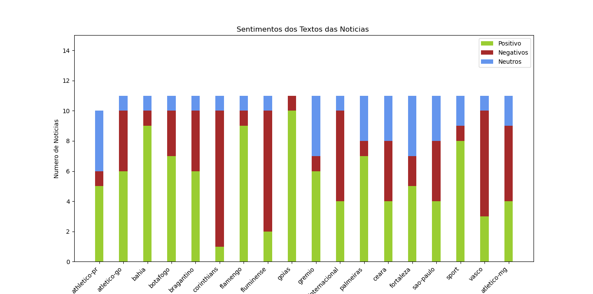

<!-- _class: invert -->

# Analisando o Sentimento do GloboEsporte.com
- Luiz Alexandre Moreira Barros
- Especialização em Ciências de Dados
- 31/12/2020
---

---
# **Introdução**
---
# **A imprensa Esportiva no Brasil**
- De acordo Fonseca (1997), os primeiros registros que se tem é do Le Sport (1854), que publicava crônicas sobre haras, turfe e caça, além de sessões de canoagem, natação, pesca, boxe, bilhar e outros esportes.

- A história do jornalismo esportivo no Brasil ocorre praticamente da mesma maneira. A partir do interesse das classes mais altas, dos jornalistas e escritores mais respeitados é que a imprensa começou a se preocupar com o esporte, principalmente com o futebol

---
# **Objetivo do Trabalho**

- Como afirma Gomes(2016), existe a disseminação do sentimento, que afeta os membros de certos grupos e em certas circunstâncias, de que os meios de comunicação são tendenciosos contra o nosso lado e favorecem o lado adversário, assim como os mecanismos que lhe são subjacentes.

- Esse cenário não difere entre os torcedores que consomem as notícias esportivas.

- Portanto, o objetivo desse trabalho é analisar se a presença de parcialidade nas notícias apresentadas pelo portal GloboEsporte.com, através da utilização do Processamento de Linguagem Natural.


---
# **GloboEsporte.com**

---
# **O que é o GloboEsporte.com ?**

- O GloboEsporte.com é um portal de notícias de esporte brasileiro mantido pelo Grupo Globo e sob orientação da Central Globo de Esporte
- Lançado no Ano de 2004
- O portal disponibiliza o conteúdo de Jornalismo Esportivo das empresas do Grupo Globo (Rede Globo, SporTV, Premiere, Combate, rádios CBN e Globo, jornais e revistas), além de conteúdo próprio de reportagens em texto, foto, áudio e vídeo e de transmissões ao vivo

---
# **Relevância do GloboEsporte.com**


---
# **Estrutura da notícia do GloboEsporte.com**
- Titulo
- Subtitulo
- Data
- Texto
---
# **Metodologia**

---
# **Pacotes Utilizados**
- Manipulação de Dados
  - Pandas
  - Numpy
  - Beautiful Soup
- Manipulação de Banco de Dados
  - Pymongo
- Raspagem de Dados Web
  - Selenium
  - requests
  - urllib

---
# **Pacotes Utilizados**
- Manipulação de Dados Textuais
  - textblob
  - nltk
  - re
- Manipulação de Gráficos
  - WordCloud
  - cv2
  - matplotlib

---
# **Estrutura do Projeto**

- [Extraindo url das noticias](https://github.com/LuizAlexandre21/Analise_Sentimentos_GE/blob/main/Extraindo%20Links.py)

- [Extraindo elementos textuais](https://github.com/LuizAlexandre21/Analise_Sentimentos_GE/blob/main/Extraindo%20texto.py)  
  - Titulo
  - Subtitulo
  - Texto
  - Data
- Tratamento dos Elementos Textuais
- Nuvens de Palavras
- Analise de Sentimentos

---
# **Tratamento dos Elementos Textuais**
- Pacotes importados
```
from pymongo import MongoClient
from nltk.tokenize import word_tokenize
from nltk.corpus import stopwords
import pandas as pd
import re
import nltk
```

---
# **Tratamento dos Elementos Textuais**
- Importando banco de dados
```
client = MongoClient()
data = client['Jornais']
data = data['Artigo']
data = pd.DataFrame(list(data.find()))
```

- Removendo linhas repetidas
```
data=data.drop_duplicates(subset=['Texto'])
```
---
# **Tratamento dos Elementos Textuais**
- Tokenização dos Texto

```
Texto =[]
Titulo=[]
Subtitulo=[]

for i in data.columns:
    if i == '_id':
        continue
    elif i == 'Data':
        continue
    elif i =='Texto':
        for k in data['Texto']:
            Texto.append(word_tokenize(k))

    elif i =='Titulo':
        for k in data['Titulo']:
            Titulo.append(word_tokenize(k))

    elif i =='Subtitulo':
        for k in data['Subtitulo']:
            Subtitulo.append(word_tokenize(k))

```

---
# **Tratamento dos Elementos Textuais**

- Trocando a caixa
```
Texto_lw = []
Titulo_lw = []
Subtitulo_lw = []

for i in Texto:
    Texto_lw.append(lower(i))

for i in Titulo:
    Titulo_lw.append(lower(i))

for i in Subtitulo:
    Subtitulo_lw.append(lower(i))

```

---
# **Tratamento dos Elementos Textuais**
- Removendo as stopwords
```
# Removendo as stopwords
stopwords = nltk.corpus.stopwords

Texto_cl=[]
Titulo_cl=[]
Subtitulo_cl=[]

for j in Texto_lw:
    if j is not stopwords.words('portuguese'):
        Texto_cl.append(j)

for j in Titulo_lw:
    if j is not stopwords.words('portuguese'):
        Titulo_cl.append(j)

for j in Subtitulo_lw:
    if j is not stopwords.words('portuguese'):
        Subtitulo_cl.append(j)
```
---
# **Nuvens de Palavras**

- Pacotes importados
```
from pymongo import MongoClient
import pandas as pd
import nltk
import matplotlib.pyplot as plt
from wordcloud import WordCloud
import cv2
import matplotlib.colors
```
---
# **Nuvens de Palavras**
- Agregando os Elementos Textuais
```
clubes = ['athletico-pr','atletico-go','bahia','botafogo','bragantino','corinthians','flamengo','fluminense',
'goias','gremio','internacional','palmeiras','ceara','fortaleza','sao paulo','sport','vasco','atletico-mg']
for i in clubes:
    dados = data[data['Time']== i]

    texto = dados['Texto_limpo'].reset_index(drop=True)
    subtitulo = dados['Subtitulo_limpo'].reset_index(drop=True)
    titulo = dados['Titulo_limpo'].reset_index(drop=True)

    texto = texto[0]+texto[1]+texto[2]+texto[3]+texto[4]+texto[5]+texto[6]+texto[7]
    subtitulo = subtitulo[0]+subtitulo[1]+subtitulo[2]+subtitulo[3]+subtitulo[4]+subtitulo[5]+subtitulo[6]+subtitulo[7]
    titulo = titulo[0]+titulo[1]+titulo[2]+titulo[3]+titulo[4]+titulo[5]+titulo[6]+titulo[7]


```
---
# **Nuvens de Palavras**
- Frequência de Palavras
```
  plt.figure(figsize=(10,5))
  fd = nltk.FreqDist(subtitulo)
  fd.plot(30,title = "Palavras x Frequência",cumulative=False)
  # Titulo
  plt.figure(figsize=(10,5))
  fd = nltk.FreqDist(titulo)
  fd.plot(30,title = "Palavras x Frequência",cumulative=False)
  # Texto
  plt.figure(figsize=(10,5))
  fd = nltk.FreqDist(texto)
  fd.plot(30,title = "Palavras x Frequência",cumulative=False)

  text = " ".join(texto)
  title= " ".join(titulo)
  subtitle = " ".join(subtitulo)

```

---
# **Nuvens de Palavras**
- Criando Mapas de Cores

```
  cmap1 = matplotlib.colors.LinearSegmentedColormap.from_list("", ["red","black"])
```

- Criando as Nuvens de Palavras
```
imagem = cv2.imread(i+".jpg")
  gray = cv2.cvtColor(imagem, cv2.COLOR_BGR2GRAY)
  ret,mask = cv2.threshold(gray,250,255,cv2.THRESH_BINARY)

  # Criando a nuvem de Palavras - Titulo
  wordcloud = WordCloud(background_color="white",width=800, height=800,
   mask=mask, colormap=cmap, collocations = False).generate(title)
  fig = plt.figure(figsize=(20,10))
  plt.imshow(wordcloud, interpolation='bilinear')
  plt.axis("off")
  fig.savefig(i+'_titulo', dpi=fig.dpi)
  plt.show()
```
---

# **Analise de Sentimentos**
- Pacotes importados
```
import pandas as pd
from textblob import TextBlob
from textblob.sentiments import NaiveBayesAnalyzer
from pymongo import MongoClient
import matplotlib.pyplot as plt
import matplotlib.colors
import pandas as pd
import numpy as np
```

---
# **Analise de Sentimentos**
- Calculando os sentimentos
```
texto = data['Texto'].reset_index(drop=True)
sentimento_text = []
p_pos_text = []
p_neg_text = []  
for i in texto:
    blob = TextBlob(i, analyzer=NaiveBayesAnalyzer())
    sentimento_text.append(blob.sentiment[0])
    p_pos_text.append(blob.sentiment[1])
    p_neg_text.append(blob.sentiment[2])
    print("tops")
```

---
# **Analise de Sentimentos**
- Ajustando os Sentimentos predominantes
```
sent['p_sent_titulo'] = sent['p_pos_titulo']-sent['p_neg_titulo']

sentimento_tit=[]
# Salvando o sentimento
for i in sent['p_sent_titulo']:
    if i>0.1:
        sentimento_tit.append('Pos')
    elif i< -0.1:
        sentimento_tit.append('Neg')
    else:
        sentimento_tit.append('Neutro')

sent['Novo_sentimento_titulo']=sentimento_tit
```
---
# **Analise de Sentimentos**
- Contabilizando os sentimentos por time
```
positivos_tit=[]
clube = ['athletico-pr','atletico-go','bahia','botafogo','bragantino','corinthians','flamengo',
'fluminense','goias','gremio','internacional','palmeiras','ceara','fortaleza','sao-paulo','sport','vasco','atletico-mg']


for i in clube:
    data_tit=sent[sent['Time']==i]['Novo_sentimento_titulo'].to_list()
    positivos_tit.append(data_tit.count('Pos'))

```

---
# **Analise de Sentimentos**
- Criando gráfico em barras

```
fig, ax = plt.subplots()

ax.bar(clube,positivos_tit,0.5,label='Positivos',color='springgreen')
ax.bar(clube,negativos_tit,0.5,bottom=positivos_tit,label='Negativos',color='maroon')
ax.bar(clube, neutros_tit, 0.5, bottom=np.array(negativos_tit)+np.array(positivos_tit),color='cornflowerblue')
plt.xticks(rotation=45, ha='right')
plt.ylim(0,15)
plt.legend(['Positivo','Negativos','Neutros'])
plt.ylabel("Numero de Noticias")
plt.title("Sentimentos dos Titulos das Noticias ")
plt.show()
```

---
# **Resultados**

---
# **Resultados**
- Frequência de Palavras dos Titulos - Ceará

---
# **Resultados**

- Frequência de Palavras dos Subtitulos - Fortaleza


---
# **Resultados**
- Frequência de Palavras dos Textos - Ceará


---
## **Resultados**
- Nuvens de palavras do Titulo - Ceará

---
## **Resultados**
- Nuvens de palavras do Subtitulo - Fortaleza

---
## **Resultados**
- Nuvens de palavras do Texto - Goias


---
## **Resultados**
- Sentimentos dos Títulos

---
## **Resultados**
- Sentimentos dos Subtítulos

---
## **Resultados**
- Sentimentos dos Textos


---
## **Resultados**
- Relação Vitórias ou Títulos


---
## **Resultados**
- Relação Vitórias x Subtitulo


---
## **Resultados**
- Relação Vitórias x Texto


---
## **Conclusão**

- Goiás apresenta maior número de notícias positivas
- Corinthians apresenta o maior número de notícias negativas
- Presença de neutralidade nos títulos das notícias relacionadas aos times cearenses
- Relação inversa entre notícias positivas e número de vitórias
---

## **Homework**
- Necessidade de uma amostra de notícias maior
- Aplicação de metodologias de séries temporais
  - Modelos VAR e VEC
  - Teste de Causalidade
- Maior exploração na literatura
- Aprimoramento do dicionário de stopwords

---

# **Contato**

Email $\rightarrow$  LuizAlexandre21@outlook.com
Linkedln $\rightarrow$ https://www.linkedin.com/in/luiz-alexandre-moreira-barros-104a971a9

# **GitHub do Projeto**

https://github.com/LuizAlexandre21/Analise_Sentimentos_GE
